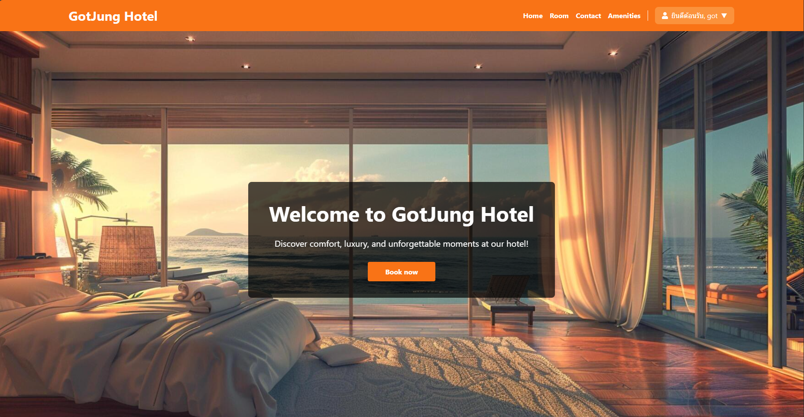

# GotJung_Hotel



---

**GotJung_Hotel** เป็นระบบการจองโรงแรมออนไลน์ที่พัฒนาด้วยภาษา PHP, HTML, CSS (TailwindCSS) และฐานข้อมูล MySQL เหมาะสำหรับการจัดการการจองและการบริหารจัดการห้องพัก/บริการ โดยแบ่งการทำงานออกเป็น 2 ส่วนหลักคือ **Admin (ผู้ดูแลระบบ)** และ **Customer (ลูกค้า)**

---

## Introduction
สวัสดีครับ ผมนายธนพัฒน์ ทองบุรี ครับ **directory นี้เป็นโปรเจกต์วิชา BACK-END** นะครับ 
โดยโปรเจกต์นี้ออกแบบและพัฒนาระบบเว็บไซต์ที่เกี่ยวข้องกับการจองห้องพักออนไลน์ ซึ่งใช้ภาษา PHP เป็นตัวขับเคลื่อนหลัก 
พร้อมด้วยฐานข้อมูล MySQL เพื่อจัดการข้อมูลลูกค้า การจอง และบริการของโรงแรม 
ระบบนี้เน้นความง่ายในการใช้งานและประสิทธิภาพในการจัดการข้อมูล
สามารถเอาไปต่อยอดใช้งานได้ครับ

ขอบคุณที่เข้ามาอ่านนะครับ 

---

## **คุณสมบัติหลัก**

### **สำหรับผู้ดูแลระบบ (Admin)**
- จัดการบริการ/ห้องพัก: เพิ่ม/แก้ไข/ลบข้อมูล เช่น ชื่อบริการ ราคา ประเภท และคำอธิบาย
- จัดการการจอง: ดูและบริหารรายการการจองของลูกค้า
- จัดการข้อความ: อ่าน/ตอบกลับ/ลบข้อความที่ได้รับจากลูกค้า
- ระบบ Dashboard: แสดงข้อมูลภาพรวมของการใช้งานระบบ

### **สำหรับลูกค้า (Customer)**
- สมัครสมาชิกและเข้าสู่ระบบ: สร้างบัญชีผู้ใช้ใหม่และล็อกอินเพื่อใช้งาน
- จองบริการ/ห้องพัก: เลือกบริการหรือห้องพักพร้อมยืนยันการจอง
- แก้ไขโปรไฟล์: แก้ไขข้อมูลส่วนตัว
- เขียนรีวิว: แบ่งปันประสบการณ์และความคิดเห็นเกี่ยวกับบริการที่ได้รับ

---

## **การติดตั้ง**

### **เครื่องมือที่จำเป็น**
- **Visual Studio Code**: ใช้สำหรับแก้ไขและพัฒนาโค้ด
  - ติดตั้งส่วนเสริมที่แนะนำ เช่น:
    - PHP IntelliSense
    - Tailwind CSS IntelliSense
    - MySQL
- **XAMPP**: เซิร์ฟเวอร์ที่รองรับ PHP และ MySQL สำหรับการรันโปรเจกต์
- **phpMyAdmin**: สำหรับจัดการฐานข้อมูล MySQL
- **Git**: ใช้สำหรับจัดการเวอร์ชันของโปรเจกต์และ Clone ไฟล์จาก GitHub

---

### **ข้อกำหนดเบื้องต้น**
- **PHP**: เวอร์ชัน 7.4 ขึ้นไป
- **MySQL**: ฐานข้อมูลสำหรับจัดเก็บข้อมูลโปรเจกต์
- **Web Browser**: เช่น Google Chrome หรือ Firefox สำหรับทดสอบโปรเจกต์

---

## **ขั้นตอนการติดตั้ง**

1. **Clone โปรเจกต์:**
   ```bash
   git clone https://github.com/username/GotJung_Hotel.git

2. **ตั้งค่าฐานข้อมูล:**
    เปิด phpMyAdmin และนำเข้าไฟล์ hotel_bookings.sql
    ตั้งค่าการเชื่อมต่อฐานข้อมูลในไฟล์ includes/db_connect.php

3. **รันโปรเจกต์**

    วางโปรเจกต์ในโฟลเดอร์ htdocs (สำหรับ XAMPP)
    เปิดใช้งานผ่าน URL:
    ```ardunio
    http://localhost/GotJung_Hotel/

4. **แก้ไขเพิ่มเติม (ถ้าจำเป็น):**
    ตรวจสอบไฟล์ .htaccess หรือค่า php.ini เพื่อปรับแต่งให้เหมาะสมกับเซิร์ฟเวอร์

--- 

## **สถานะการพัฒนา**

สิ่งที่อยากพัฒนาต่อคือ:

1. **ระบบแก้ไขจัดการบริการ/ห้องพัก** (`manage_services.php`):  
   - เพิ่มฟังก์ชันสำหรับแก้ไขข้อมูลบริการ เช่น ชื่อ ราคา และคำอธิบาย
   - ปรับปรุง UI ให้ผู้ดูแลสามารถใช้งานได้ง่ายขึ้น
   - เพิ่มการยืนยันก่อนบันทึกการเปลี่ยนแปลงข้อมูล

2. **ระบบรีวิว** (`Review.php`):  
   - เพิ่มฟังก์ชันให้ลูกค้าสามารถเขียนรีวิวสำหรับบริการที่ใช้
   - แสดงรีวิวพร้อมชื่อผู้ใช้และวันที่
   - ระบบกรองรีวิว เช่น การเรียงลำดับตามคะแนนหรือวันที่
   - เพิ่มฟังก์ชันการลบ/ซ่อนรีวิวสำหรับแอดมิน

---

## ผู้พัฒนา
  - นาย ธนพัฒน์ ทองุบรี 004 font-back & back-end
  - นาย นันทวัตน์ หลังชาย 008 UX/UI
  - นางสาว อัฟฟา มาแต 010 Writer
